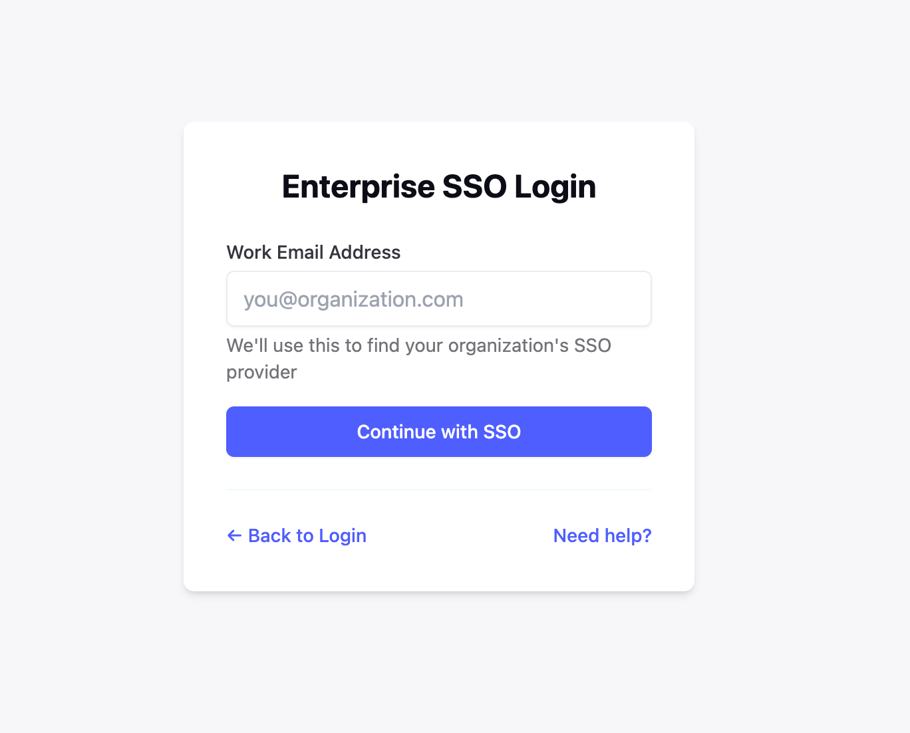

# Single Sign On Example App with Scalekit

A simple web application demonstrating Single Sign-On (SSO) authentication using Scalekit, Node.js, Express, and Tailwind CSS. This example shows how to implement secure authentication flows using Scalekit's SSO service.



For more screenshots, see the [screenshots folder](public/images).

## Clone this folder

```bash
git clone --filter=blob:none --no-checkout git@github.com:scalekit-developers/nodejs-example-apps.git
cd nodejs-example-apps
git sparse-checkout init --cone
git sparse-checkout set expressjs-loginbox-authn
git checkout main  # or the branch you want
```

<details>
<summary>More details on cloning the repo</summary>

- This specifically clones the expressjs-loginbox-authn folder and not the entire repo.
- VSCode contributors have to enable `git.openRepositoryInParentFolders` in settings.
</details>

## Features

- Single Sign-On (SSO) authentication powered by Scalekit
- Secure user authentication and session management
- Profile viewing and management after successful login
- Clean and modern UI using Tailwind CSS
- Server-side rendering with EJS templates
- Example of Scalekit SSO integration

## Setup

You can use either Bun or npm to run this project.

### Using Bun (Recommended)

1. Install dependencies:

```bash
bun install
```

2. Build Tailwind CSS:

```bash
bun run build:css
```

3. Start the server:

```bash
bun run dev
```

### Using npm

1. Install dependencies:

```bash
npm install
```

2. Build Tailwind CSS:

```bash
npm run build:css
```

3. Start the server:

```bash
npm run dev
```

4. Visit http://localhost:3000 in your browser

## Demo Credentials

- Email: demo@example.com
- Password: demo123

## Technologies Used

- Scalekit SSO Service
- Bun.js Runtime
- Node.js
- Express.js
- EJS Templates
- Tailwind CSS
- express-session for session management
- bcryptjs for password hashing
